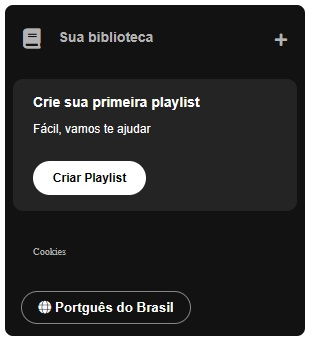

# Imersão Front-end da Alura

## 1º Dia de Aula - Revisão de HTML, CSS e JS na prática

Nesse primeiro dia, construímos o __Sidebar__ aplicando algumas técnicas de HTML, CSS e CSS Flexbox

## 2º Dia de Aula - Estilo Avançado e Posicionamento_ Transformando Layouts

